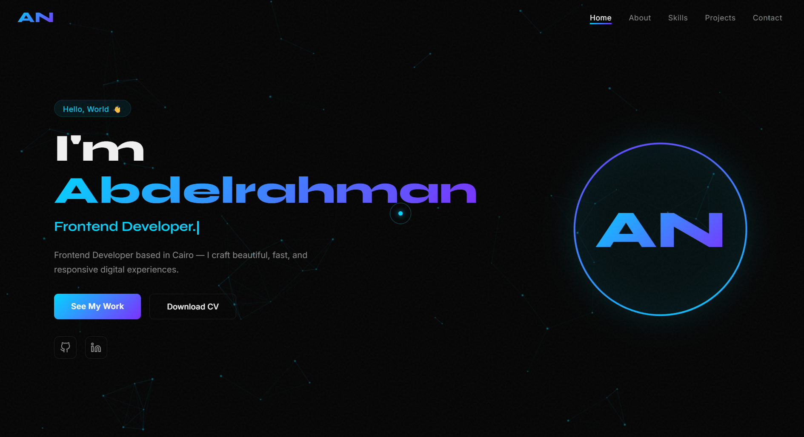

# 🚀 Abdelrahman Nasef — Personal Portfolio

A futuristic, award-winning personal portfolio website built with pure HTML, CSS, and JavaScript.

---

## ✨ Features

- 🌌 **Particles Background** — Animated canvas particles in hero
- 🖱️ **Custom Cursor** — Magnetic glowing cursor effect
- ⌨️ **Typing Effect** — Cycles through titles dynamically
- 📊 **Skill Bars** — Animated on scroll
- 🔢 **Counter Animation** — Stats count up on scroll
- 📱 **Fully Responsive** — Works on all devices
- 🎨 **Glassmorphism Cards** — Modern UI design
- 📬 **Contact Form** — With JS validation

---

## 🛠️ Tech Stack

- **HTML5** — Semantic structure
- **CSS3** — Animations, Flexbox, Grid, Variables
- **JavaScript** — Canvas API, Intersection Observer, DOM

---

## 🚀 Live Demo

🔗 [abdoibrahim20.github.io/portfolio](https://abdoibrahim20.github.io/portfolio)

---

## 🤝 Contact

**Abdelrahman Nasef** — Available for Freelance
📧 nasefabdo600@gmail.com

